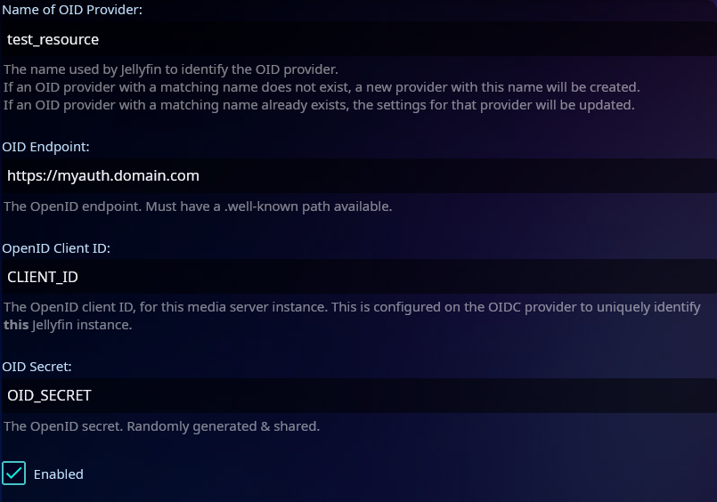
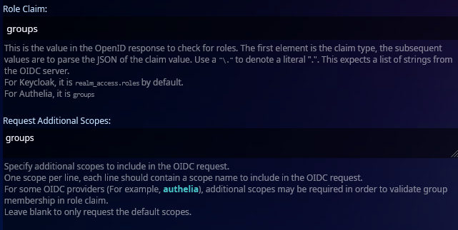

# Jellyfin

> Due to the current limitations of the Jellyfin SSO plugin, this integration will only work in a browser. When tested, the Jellyfin app did not work and displayed an error, even when custom menu buttons were created.

> To view the original references and a full list of capabilities, please visit the [Jellyfin SSO OpenID Section](https://github.com/9p4/jellyfin-plugin-sso?tab=readme-ov-file#openid).

## Requirements

- [Jellyfin Server](https://jellyfin.org/downloads/server)
- [Jellyfin SSO Plugin](https://github.com/9p4/jellyfin-plugin-sso)
- HTTPS connection to your Jellyfin server

## OIDC - Pocket ID Setup

To start, we need to create a new SSO resource in our Jellyfin application.

> Replace the `JELLYFINDOMAIN` and `PROVIDER` elements in the URL.

1. Log into the admin panel, and go to OIDC Clients -> Add OIDC Client.
2. **Name**: Jellyfin (or any name you prefer)
3. **Callback URL**: `https://JELLYFINDOMAIN.com/sso/OID/redirect/PROVIDER`
4. For this example, we’ll be using the provider named "test_resource."
5. Click **Save**. Keep the page open, as we will need the OID client ID and OID secret.

## OIDC Client - Jellyfin SSO Resource

1. Visit the plugin page (<i>Administration Dashboard -> My Plugins -> SSO-Auth</i>).
2. Enter the <i>OID Provider Name (we used "test_resource" as our name in the callback URL), Open ID, OID Secret, and mark it as enabled.</i>
3. The following steps are optional based on your needs. In this guide, we’ll be managing only regular users, not admins.

> To manage user access through groups, follow steps **4, 5, and 6**. Otherwise, leave it blank and skip to step 7.

4. Under <i>Roles</i>, type the name of the group you want to use. **Note:** This must be the group name, not the label. Double-check in Pocket ID, as an incorrect name will lock users out.
5. Skip every field until you reach the **Role Claim** field, and type `groups`.
   > This step is crucial if you want to manage users through groups.
6. Repeat the above step under **Request Additional Scopes**. This will pull the group scope during the sign-in process; otherwise, the previous steps won’t work.

7. Skip the remaining fields until you reach **Scheme Override**. Enter `https` here. If omitted, it will attempt to use HTTP first, which will break as WebAuthn requires an HTTPS connection.
8. Click **Save** and restart Jellyfin.

## Optional Step - Custom Home Button

Follow the [guide to create a login button on the login page](https://github.com/9p4/jellyfin-plugin-sso?tab=readme-ov-file#creating-a-login-button-on-the-main-page) to add a custom button on your sign-in page. This step is optional, as you could also provide the sign-in URL via a bookmark or other means.

## Signing into Your Jellyfin Instance

Done! You have successfully set up SSO for your Jellyfin instance using Pocket ID.

> **Note:** Sometimes there may be a brief delay when using the custom menu option. This is related to the Jellyfin plugin and not Pocket ID.

If your users already have accounts, as long as their Pocket ID username matches their Jellyfin ID, they will be logged in automatically. Otherwise, a new user will be created with access to all of your folders. Of course, you can modify this in your configuration as desired.

This setup will only work if sign-in is performed using the `https://jellyfin.example.com/sso/OID/start/PROVIDER` URL. This URL initiates the SSO plugin and applies all the configurations we completed above.
