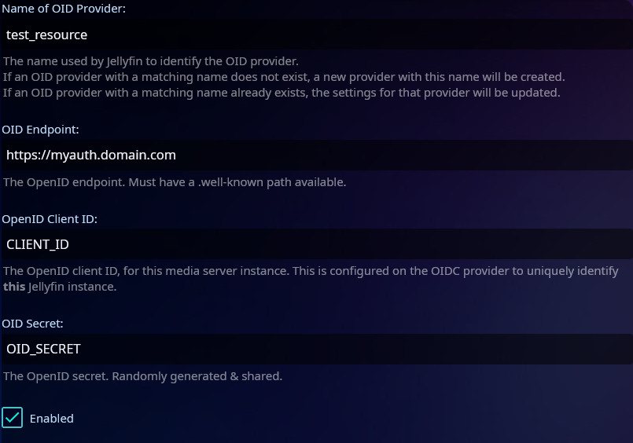
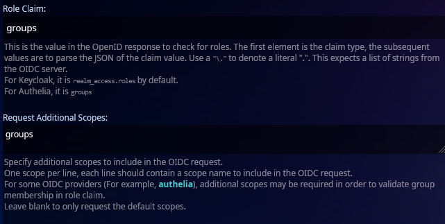

# Jellyfin SSO Integration Guide

> Due to the jellyfin sso plugin's current limitations, this will only work in a browser. Last I tested the jellyfin app\
> won't work and will give an error even if you create the custom menu buttons.

>To see the original references and a full list of capabilities please visit the [Jellyfin SSO OpenID Section](https://github.com/9p4/jellyfin-plugin-sso?tab=readme-ov-file#openid).

### Requirements
- [Jellyfin Server](https://jellyfin.org/downloads/server)
- [Jellyfin SSO Plugin](https://github.com/9p4/jellyfin-plugin-sso)
- HTTPS connection to your jellyfin server

### OIDC - Pocket-ID Setup
First we need to create a new SSO resource in our jellyfin application.
> Replace the `JELLYFINDOMAIN` and the `PROVIDER` elements in the url.
1) Log into the admin panel, OIDC Clients -> Add OIDC Client.
2) Name: Jellyfin (Or anything you want)
3) Callback URL: https://JELLYFINDOMAIN.com/sso/OID/redirect/PROVIDER
4) For this example we will be using the PROVIDER "test_resource"
5) click save - keep the page open as we will need the OID client ID and the OID secret.

### OIDC Client - Jellyfin SSO Resource

1) Vist the plugin page (<i>Administration Dashboard -> my plugins -> SSO-Auth</i>)
2) Write the <i>Name of OID Provider (we used test_resource as our name in the call back url, the Open ID, and OID Secret, and mark it as enabled.)</i>
3) The following is just dependent on what you want, but I only wanted to manage my users and not my admins through this integration.

> If you want to use groups to manage if a user has access to your application follow steps <b>4, 5, 6,</b>  otherwise simply leave it blank amd skip to step 7.

4) Under <i>Roles</i>, type the name of the group you want to use.<b> Note:This is the name and not the label, please double check in Pocket-ID as this will lock users out if its incorrect.</b>
5) We will be skipping every field until we reach the <b>Role Claim</b> field. Here type `groups`. 
> The following step is crucial if you want to manage users through groups. 
6) Do the same under <b>Request Additional Scopes</b>. This will pull the groups scope during the signin process, otherwise the steps above won't work.

7) Skip the rest of the fields until you reach <b>Scheme Override</b>. write `https` here. If you don't it will always attempt to use http first which will break as webauthn requires a https connection.
8) Click Save and restart Jellyfin.

### Optional Step -  Custom Home Button
Follow the [creating a login button on the login page](https://github.com/9p4/jellyfin-plugin-sso?tab=readme-ov-file#creating-a-login-button-on-the-main-page) to create a custom button on your sign in page. This step is optional as you could also simply provide the sign in url through a bookmark or other means.

### Signing into your jellyfin instance
Done! You have successfully setup SSO for your jellyfin instance using Pocket-ID. 

>Note: I found that sometimes it can take a few seconds for the link to fireup when using the custom menu option. This is tied to the jellyfin plugin and not related to Pocket-ID.

If you have users with a pre-existing account, as long as their Pocket-ID username matches their jellyfin id this will log them in automatically, otherwise it will create a new user with access to all of your folders. Of course this can be changed and played with in your own config.

Note that this will only work, if the sign in is performed using the `https://jellyfin.example.com/sso/OID/start/PROVIDER` url. This initiates the SSO plugin and all the config we completed above.